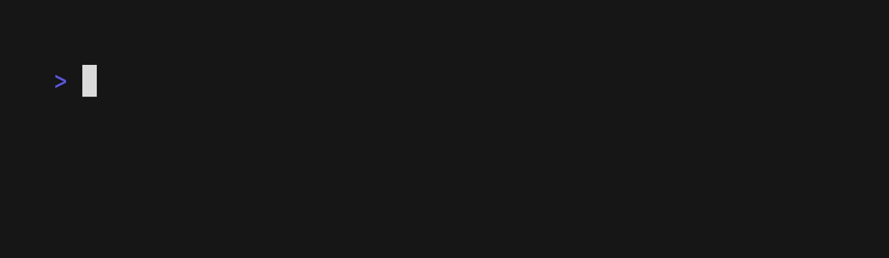
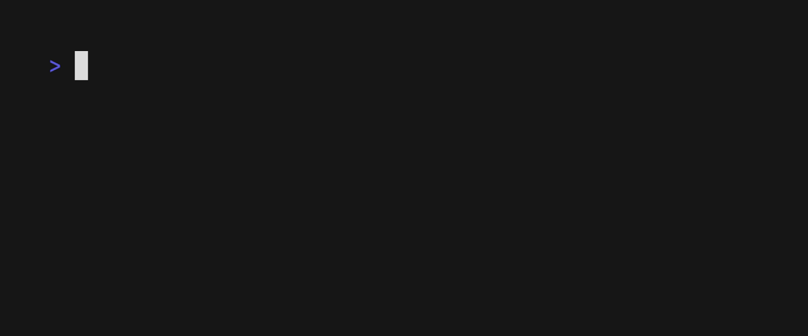
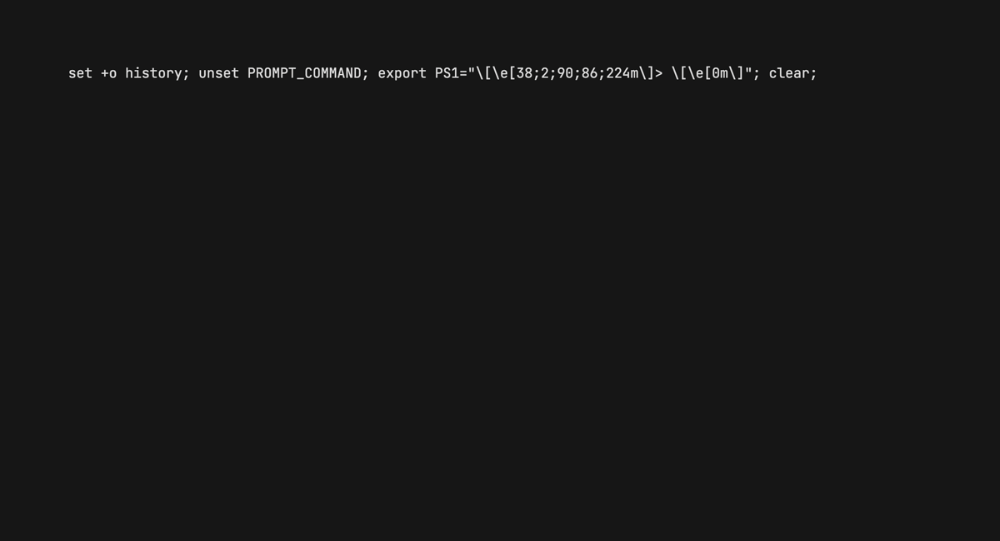
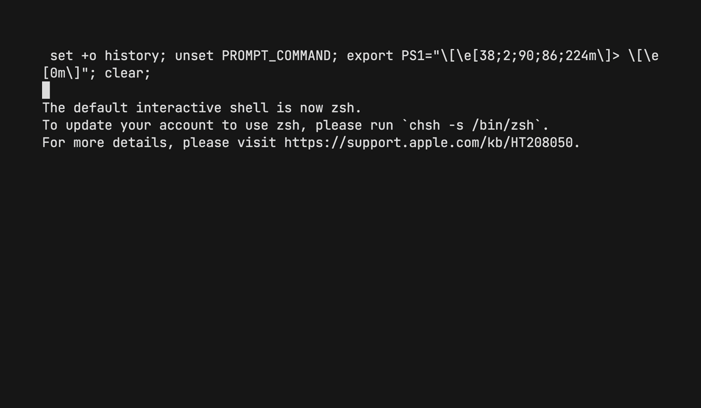

<p align="center">
  
</p>

# JET

[](https://pepy.tech/project/jet-test) 
[](https://pypi.org/project/jet-test/)

</img>

JET is a testing library for python aimed at being fast to set up, easy to use and above all pleasing to the eye. Because testing does not have to be a chore to set up, clutter the terminal or ugly to look at.

##### Contents
  - [Installation](#installation)
  - [Running Tests](#running-tests)
  - [Reading Reports](#reading-reports)
  - [Mastering Verbosity](#mastering-verbosity)
  - [Custom Fail Conditions](#custom-fail-conditions)
  - [Further Customizations](#further-customizations)


<p align="center">
  
</p>

# Installation

> **Note**
> JET requires [`gum`](https://github.com/charmbracelet/gum) to be installed and available on your `PATH`.

Best way to install jet is through pip:

```sh
pip install jet-test
```

# Running Tests

```sh
jet run <option>
```

- `--all`: Run all test modules. Skips initial module selection.
- `--dir`: Path to tests directory. Defaults to /tests when not supplied.
- `--files`: List of modules to consider instead of entire directory.
- `--quiet`: Disable test ouput verbose as they run.
- `--n-jobs`: Number of processes to use in parallel when running tests. Defaults to one.
- `--percentage`: Whether to show progress as a percentage instead of count.

<p align="center">

</p>

JET searches for the tests folder in your working directory. You can supply a different directory with the `--dir` flag. Inside it searches for all modules in the form `test_<something>.py` and uses their `__doc__` as description. JET prompts you to choose the modules to run, you can skip this by raising the `--all` flag. You can also specify individual modules by passing them to `--files`. The path of each module is always relative to the specified `--dir`.

```text
directory
│   README.md
└───tests
│   │   test_array_operations.py
│   │   test_verbose_levels.py
|   |   test_custom_fail_conditions.py
│   
...
```
Inside each module JET runs all functions that start with `test_<something>`. Below is an example test module.
```python
""""This is the __doc__ of the test module.
It will be shown as description in the module choice
""""

# this function will NOT be considered as a test 
def set_variables():
    a = 2
    b = 1
    return a,b

# this function will be considered as a test function. 
def test_sum():
    """This will be shown if the test succeds"""
    a,b = set_variables()
    assert a==b, "this will be shown if the test fails"
```
For example the following command will:
```sh
jet run --all --dir different_test_folder --files test_user_auth.py test_admin_auth.py --quiet --n-jobs 4 --percentage
```
- Skip module selection and run all modules.
- Run the tests in the modules: `different_test_folder/test_user_auth.py` and `different_test_folder/test_user_auth.py`.
- Do not display results as it runs, only end summary.
- Run tests using 4 threads.
- Show progress as a percentage (x%) instead of a count (x/n).


# Reading Reports

```sh
jet see <option>
```
Specific options for the `see` command:

- `--dir`: Path to tests directory. Defaults to /tests when not supplied.
- `--doc-width`: Width (number of columns collumns) of report doc.
- `--text-width`: Width (number of columns collumns) of text blocks in report.
- `--buffer`: Number of lines of code to show in the report.

<p align="center">

</p>

All tests that did not pass can be further inspected. The `see` command prompts the user to choose one of the failed tests and provides a collapsable report that displays:
- Error name: Failed / ErrorType / WarningType / <Customizatble> 
- Expected behaviour: User defined test `__doc__`
- Captured output: all output printed during the test runtime (`print()`)
- Test name @ test module: along with test source code highlighting error line.
- Local variables: value of test local variables at the time of failure. 

You can press `q` to close the collapsable report as to not clutter your terminal.

# Mastering Verbosity

JET displays the result of each test after it has been run, unless the `--quiet` flag is raised.

- **PASS**: Displays the tests's `__doc__`. If no `__doc__` is available, it shows the test's `__name__`.
- **FAIL**: Displays the error description. This behaviour is specially usefull of a test has more than one failing condition, for example:

```python
#tests have to start with test_
def test_example():
   """This is the text that will be display if the test passes"""
   a = 1
   b = 2
   assert a == 1, "Text displayed if a is not equal to 1"
   assert b == 2, "Text displayed if b is not equal to 2"
```

<p align="center">

</p>

# Custom Fail Conditions

Suppose you want a test to fail if its' running time exceeds 0.5 seconds. We do that by creating a wrapper that raises a custom error when the condition is failed.

```python
import timeit
import time
from functools import wraps

def timebounded(test_function):
    """Example wrapper for a custom suport.
    Throws an error if the wrapped function exceeds a certain amount of time to run"""

    @wraps(test_function)
    def wrappee():
        elapsed = timeit.timeit(test_function, number=1)
        if elapsed > 0.5:
            raise PatienceError(
                f"CUSTOM ERROR: The function called {test_function.__name__} exceded my patience"
            )

    return wrappee

# Just wrap wahtever tests you want with the timebounded function and you're good to go.
@timebounded
def test_timings_of_calculation():
    """The function should not exeed 0.5 seconds."""
    time.sleep(1)
```

The custom error and description and variables will show up both on the run erbose but also in the error report. This example can easily be expanded to add different and more complex failing conditions such as memory allocation and network usage etc.

<p align="center">

</p>

# Further Customizations

Global JET customization options:

```sh
jet <option> <command>
```

- `--foreground`: color (hex, rgb or terminal256) for foreground elements.
- `--background`: color (hex, rgb or terminal256) for background.
- `--pass-color`: color (hex, rgb or terminal256) for pass tests.
- `--failed-color`: color (hex, rgb or terminal256) for failed tests.
- `--error-color`: color (hex, rgb or terminal256) for tests that result in errors.
- `--warning-color`: color (hex, rgb or terminal256) for tests that throw warnings.

<p align="center">

</p>
